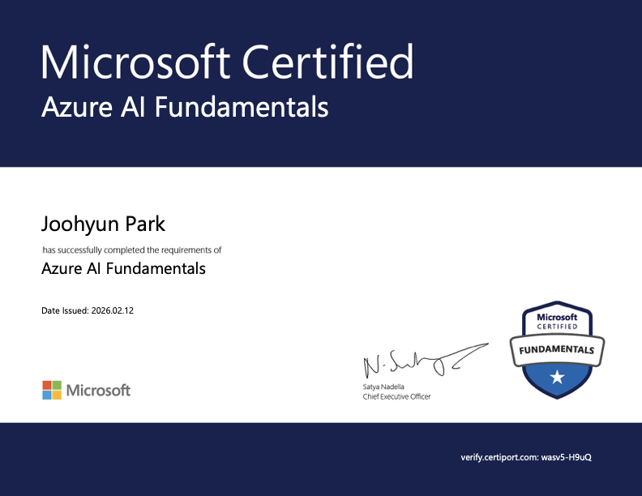

# MS_SAY_EJP — MS AI Academy 학습 아카이브

> **[🇰🇷 한국어](#-한국어)** · **[🇺🇸 English](#-english)**

---

## 🇰🇷 한국어

마이크로소프트 AI 아카데미(SAY 과정, 2024–2026) 수료 과정에서 작성한 코드·노트·프로젝트 아카이브입니다. AI-900(Azure AI Fundamentals) 자격 취득으로 마무리했으며, 과정에서 학습한 내용을 6개 모듈로 정리했습니다.

### 📜 수료 증빙

- **자격**: Microsoft Certified — Azure AI Fundamentals (AI-900)
- **발급일**: 2026-02-12
- **검증**: [verify.certiport.com](https://verify.certiport.com) / 코드 `wasv5-H9uQ`
- **원본 PDF**: [assets/ai900-certificate.pdf](assets/ai900-certificate.pdf)

### 🧭 학습 모듈 (6)

| # | 모듈 | 상세 README | 상태 |
|---|---|---|---|
| ① | AI 기초 — Python · SQL · MongoDB | [modules/01/](modules/01/) | ✅ |
| ② | 데이터 수집 — 크롤링 · 공공 API | [modules/02/](modules/02/) | ✅ |
| ③ | 풀스택 웹 — HTML/JS · Flask/FastAPI · React | [modules/03/](modules/03/) | ✅ |
| ④ | Azure 인프라 — VM · Linux · Cloud | [modules/04/](modules/04/) | ⚠️ 교재 학습 |
| ⑤ | AI 이론 — 통계 · KNN · CNN · RNN | [modules/05/](modules/05/) | ✅ |
| ⑥ | MS Azure AI — GPT · Vision · Speech · Translator | [modules/06/](modules/06/) | ✅ |

> 모듈 ④는 실습 산출물이 코드가 아닌 VM 조작·네트워크 설정 중심이라 이 저장소에는 포함되지 않았습니다.

### ⭐ Highlights

1. **Azure AI Integration Suite** — Azure OpenAI(GPT), DALL·E, Vision, Speech, Translator 등 Cognitive Services를 조합한 통합 실습. 위치: [C04_AI/Feb03_AzureAI/](C04_AI/) 외 Feb04·Feb05 디렉토리.
2. **Seoul Air Quality MVC** — 서울시 대기질 공공 API를 MVC 패턴으로 수집·파싱·Oracle 적재·CSV 출력. 위치: [C01_python/1110_pyOOP_mvc_airquality/](C01_python/).

> 각 Highlight의 상세 재현 가이드는 추후 모듈별 README에 추가됩니다.

### 📝 저작 범위

<!-- Eric: 아래 3개 블록은 본인이 직접 작성해 주세요. Claude 대필 금지. -->

1. **원본 저작 (본인 작성)** — _TODO_
2. **교재 참고 (출처 표기)** — _TODO_
3. **강사 제공 코드** — _TODO_

### 🔁 재현 가이드

- Azure 구독은 교육과정 종료로 전량 동결되어 있어 이 저장소의 Azure 호출 코드는 **그대로 실행되지 않습니다**.
- 본인 Azure 구독에서 키를 발급한 뒤, 저장소 루트의 [.env.example](.env.example)을 복사해 `.env`로 만들고 변수명에 맞춰 값을 주입하면 재현할 수 있습니다.
- `AZURE_SPEECH_REGION`의 기본값 `eastus2`는 원본 실습 리전이며, 새 구독에서 발급한 리전으로 교체하십시오.

### 🔗 관련 프로젝트

- **SOHOBI** — 본 과정 이후의 후속 프로젝트 _(URL 추가 예정)_

### 📄 라이선스

[MIT License](LICENSE) — Copyright (c) 2024–2026 Joohyun "Eric" Park.

---

## 🇺🇸 English

A personal archive of code, notes, and projects written while completing the Microsoft AI Academy (SAY track, 2024–2026). The course culminated in the AI-900 (Azure AI Fundamentals) certification. Everything I built along the way is organized into six modules below.

### 📜 Certification

- **Credential**: Microsoft Certified — Azure AI Fundamentals (AI-900)
- **Issued**: 2026-02-12
- **Verify**: [verify.certiport.com](https://verify.certiport.com) · code `wasv5-H9uQ`
- **Original PDF**: [assets/ai900-certificate.pdf](assets/ai900-certificate.pdf)

### 🧭 Six Learning Modules

| # | Module | Detailed README | Status |
|---|---|---|---|
| ① | AI Foundations — Python · SQL · MongoDB | [modules/01/](modules/01/) | ✅ |
| ② | Data Ingestion — Crawling · Public APIs | [modules/02/](modules/02/) | ✅ |
| ③ | Full-Stack Web — HTML/JS · Flask/FastAPI · React | [modules/03/](modules/03/) | ✅ |
| ④ | Azure Infrastructure — VM · Linux · Cloud | [modules/04/](modules/04/) | ⚠️ Textbook-based |
| ⑤ | AI Theory — Statistics · KNN · CNN · RNN | [modules/05/](modules/05/) | ✅ |
| ⑥ | MS Azure AI — GPT · Vision · Speech · Translator | [modules/06/](modules/06/) | ✅ |

> Module ④ was delivered through VM operation and network-configuration exercises, so it did not produce source artifacts suitable for this repository.

### ⭐ Highlights

1. **Azure AI Integration Suite** — Hands-on work combining Azure OpenAI (GPT), DALL·E, Vision, Speech, and Translator Cognitive Services. Location: [C04_AI/Feb03_AzureAI/](C04_AI/) and the Feb04 / Feb05 directories.
2. **Seoul Air Quality MVC** — Ingests the Seoul open-data air-quality API through an MVC-structured pipeline (fetch → XML parse → Oracle persist → CSV export). Location: [C01_python/1110_pyOOP_mvc_airquality/](C01_python/).

> Detailed reproduction guides for each highlight will land in the per-module READMEs in a later pass.

### 📝 Authorship Scope

<!-- Eric: fill in the three blocks below yourself. Do not have Claude author them. -->

1. **Original work (authored by me)** — _TODO_
2. **Reference material (with attribution)** — _TODO_
3. **Instructor-provided code** — _TODO_

### 🔁 Reproducing the Azure code

- The Azure subscription used in class was decommissioned when the program ended, so any Azure-dependent code in this repo **will not run out of the box**.
- To reproduce, provision your own Azure resources, copy [.env.example](.env.example) to `.env`, and fill in the variables using the same names.
- The default `AZURE_SPEECH_REGION=eastus2` reflects the original classroom region — replace it with whatever region you create resources in.

### 🔗 Related Work

- **SOHOBI** — follow-up project built after this program _(URL coming soon)_.

### 📄 License

[MIT License](LICENSE) — Copyright (c) 2024–2026 Joohyun "Eric" Park.
